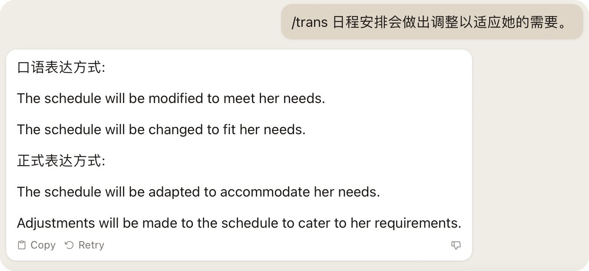

# 使用说明

这是让 AI 扮演英语老师的 prompt.

我发现我自己在学习英语的时候，经常出现两种情况：
1. 根本不知道如何用英文表达脑海里的想法，这个时候，就需要有人根据我的中文表达，告诉我相应的地道的英语表达
2. 能写出/说出英文句子来表达想法，但是要么不确定表达是否正确，要么就是下意识地按中文表达习惯来表达，这就导致 Chiglish 情况的出现

所以，我编写了这个 prompt 来让 AI 助理帮我解决上面的问题。

点击打开或下载 [prompt 全文](./prompt_trans.txt)，将内容复制到你在使用的 AI 工具中即可。

## 功能

将上面的 prompt 发送给 AI 之后，你可以在这三个方面得到它的帮助：
1. 给它发送一个英文单词，它会告诉你这个单词的中文意思，并且分别给出**口语表达**和**正式写作**中使用这个单词的例句
2. 发送英文句子或是英文段落，它会检查拼写和语法错误，然后将其翻译为中文，并且重新以英语母语使用者的方式对句子或段落进行重新表述
3. 发送 ```/trans``` + 中文，它会把中文翻译为英文，并且重新以英语母语使用者的方式对这段中文进行重新表述

### 其他说明

在 **Claude 2** 和 **GPT 3.5** 测试过，效果均达到预期，**Claude 2** 表现更加稳定。**GPT 3.5** 在识别 ```/trans``` + 中文指令的时候，有时候（尤其是疑问句时）仍然会出现直接根据消息内容回复，而不是直接将其翻译的情况。

**Q: 为什么发送中文前要加 ```/trans```？**

```
A: 因为直接发送中文，AI 经常会对消息本身进行直接回复，而不是执行将中文翻译为英文的操作。
```

**Q: 如果有时候 AI 不识别指令或者出现其他的问题怎么办？**

```
A: 可能是下文内容聊天内容累计过多， AI 丢失了部分上。解决方法就是新开启一个会话或者清空当前会话的上下文，然后重新发送 prompt。
```

### 示例
 
 
 