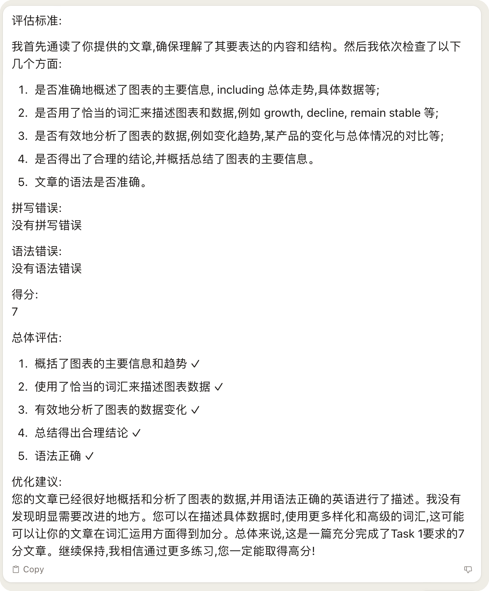
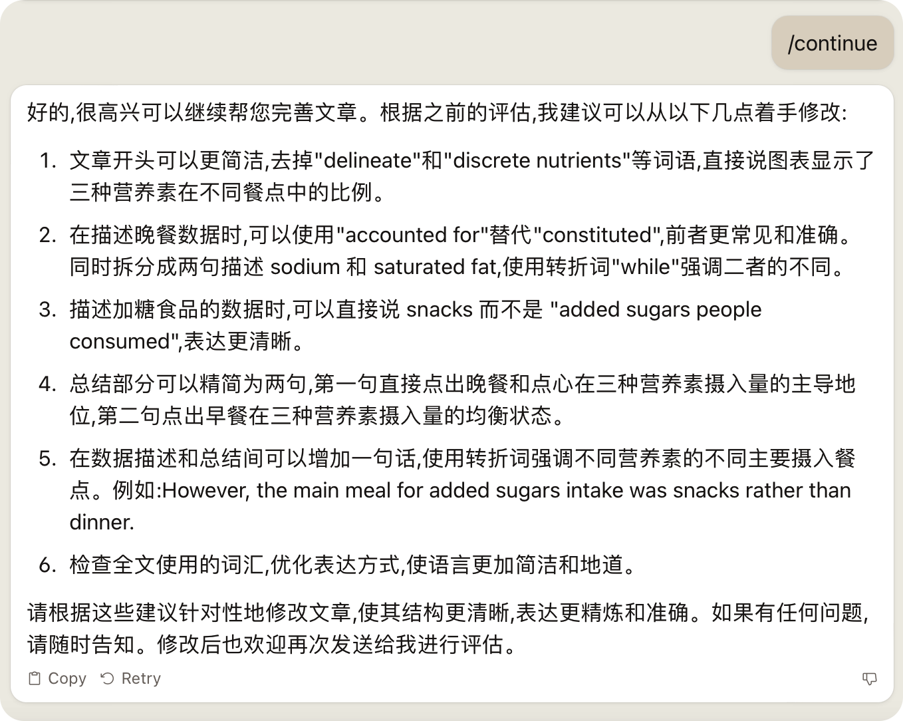
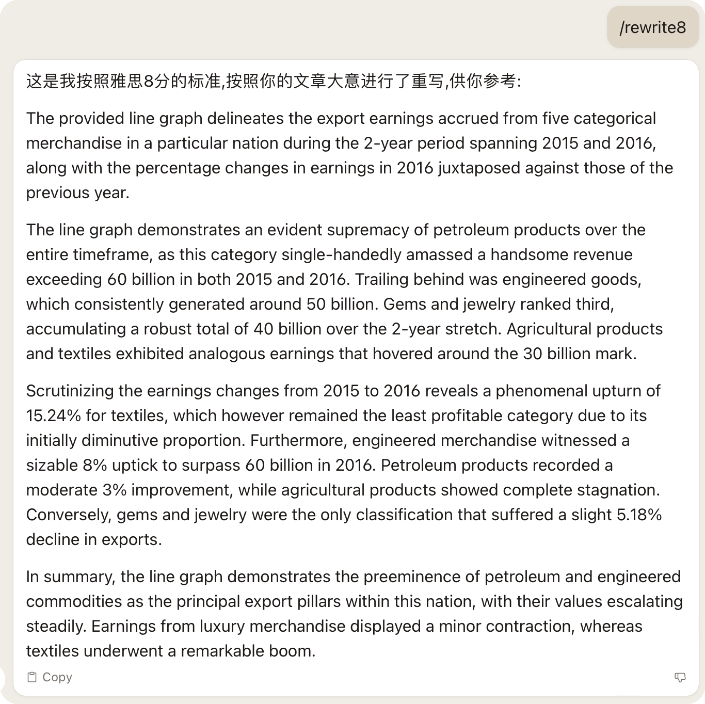

# 使用说明

这是让 AI 扮演一个雅思作文学习助理的 prompt.

在练习雅思作文的时候，如果有人能及时给出专业的评价，并且给出修改建议，能高效地提升雅思写作能力。

点击打开或下载 [prompt 全文](./prompt_essay_evaluation.txt)，将内容复制到你在使用的 AI 工具中即可。

另外，还可以配合这个 [英语学习助手](../eng/translation.md)，掌握单词和学习更地道的英语表达方式。

## 功能

根据雅思作文 Task 1 或 Task 2 的标准对作文进行评估：

1. 检查单词拼写错误
2. 检查语法错误
3. 预估作文的雅思得分
4. 作文整体评估
5. 给出优化建议

且在评估完成之后，你还可以让这个助手根据你的文章，按照雅思 7 分或 8 分的标准改写。方便我们对照，学习新的词汇、新的表达。

### 全部指令

1. 发送 ```/eval1``` + 你的文章全文，以雅思任务一的标准帮你评估文章
2. 发送 ```/eval2``` + 你的文章全文，以雅思任务二的标准帮你评估文章
3. 在评估结果显示后，发送 ```/continue```，系统根据上一步评估给出的优化建议，告诉你可以修改文章的具体哪些地方
4. 在评估结果显示后，发送 ```/rewrite7```，系统将参考雅思 7 分作文标准帮你重写文章
5. 在评估结果显示后，发送 ```/rewrite8```，系统将参考雅思 8 分作文标准帮你重写文章
6. 发送 ```/help``` 可以重新查看上述指令

### 其他说明

推荐使用 **Claude 2**，目前测试下来效果最好。

**GPT 3.5** 也可以使用，评估效果和 **Claude 2** 差不多。

在 **Google Bard** 上效果不尽如意。我特别喜欢 Bard 的言简意赅，但在雅思作文评判上，言简意赅就有点问题了。这个 prompt 在 Bard 上只能说能用。

**Q: 如果有时候 AI 不识别指令或者出现其他的问题怎么办？**

```
A: 可能是聊天内容累计过多， AI 丢失了部分上下文内容。解决方法就是新开启一个会话或者清空当前会话的上下文，然后重新发送 prompt。
```

### 示例

#### 使用 /eval1 指令的评估结果

 

#### 基于评估结果的进一步具体建议

 

#### 基于雅思 8 分标准重写

 