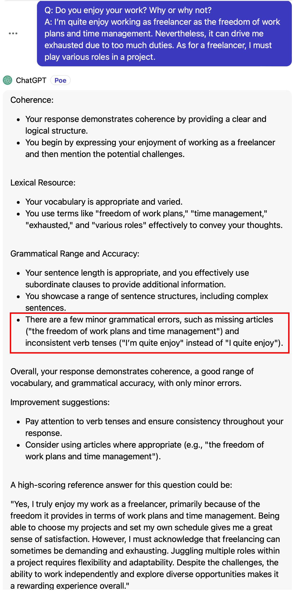
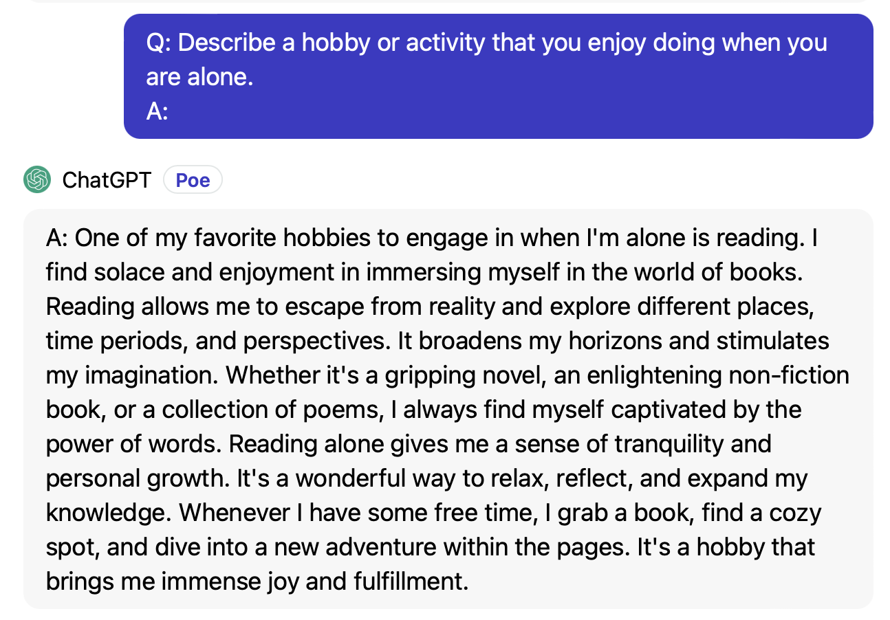

# 使用说明

这是让 AI 扮演一个雅思口语考官的 prompt.

在练习雅思口语的时候，如果有人能及时给出专业的评价，并且给出修改建议，能高效地提升雅思口语表达能力。

点击打开或下载 [prompt 全文](./prompt_speaking_evaluation.txt)，将内容复制到你在使用的 AI 工具中即可。

另外，还可以配合这个 [雅思口语考试全真模拟助手](./speaking_process.md)，按照口语考试流程练习。

## 功能

### 评估答案并提供建议

按照以下格式发送消息：

```
Q: question
A: answer
```

AI 会按照雅思口语雅思官方的关键评估准则（Key Assessment Crieria）对你的答案进行评估，并提供改进建议。同时会给你一个高分参考答案。由于和 AI 进行的是文本形式的对话，因此关键评估准则（Key Assessment Crieria）里我去掉了关于发音和流畅度方面的评估准则。

### 提供参考答案

按照以下格式发送消息：
```
Q: question
A: 
```

AI 会根据问题提供一个高分参考答案。

### 其他说明

**Q: 如果有时候 AI 不识别指令或者出现其他的问题怎么办？**

```
A: 可能是聊天内容累计过多， AI 丢失了部分上下文内容。解决方法就是新开启一个会话或者清空当前会话的上下文，然后重新发送 prompt。
```

### 示例

#### 评估答案

 

#### 看参考答案

 