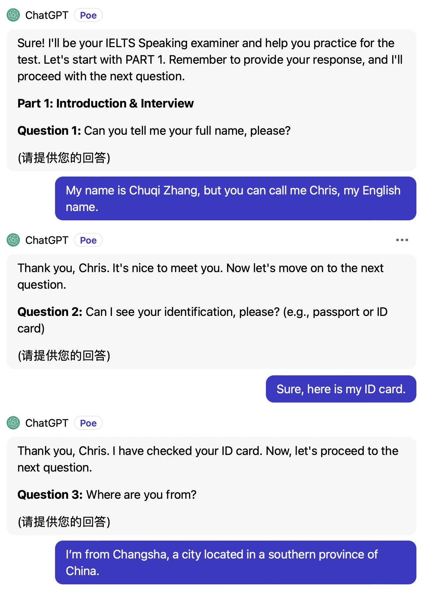
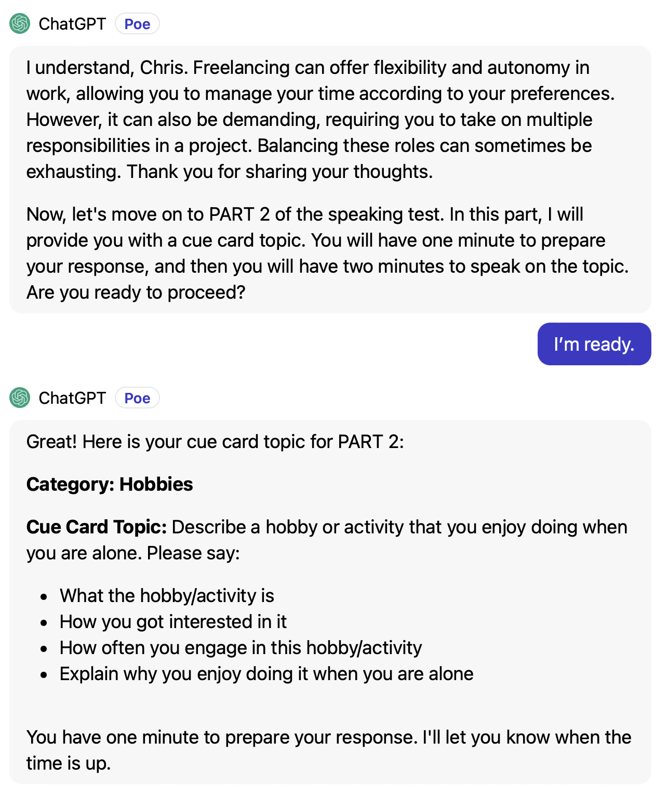
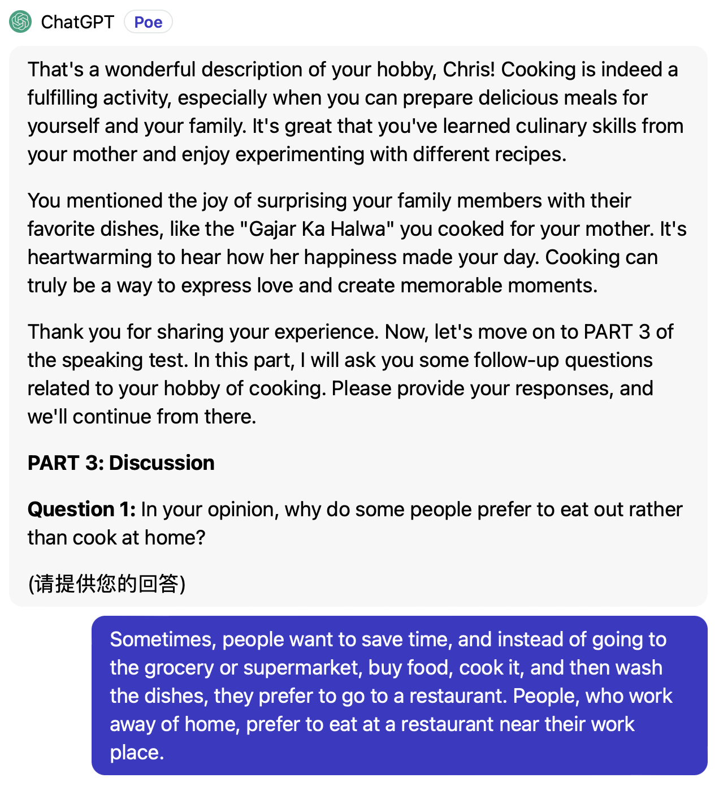

# 使用说明

这是让 AI 扮演一个雅思口语考官进行模拟考试的 prompt.

按照真实的雅思口语考试的标准和流程，随机出题来帮助用户熟悉考试流程和练习口语。

点击打开或下载 [prompt 全文](./prompt_speaking_process.txt)，将内容复制到你在使用的 AI 工具中即可。

另外，还可以配合这个 [雅思口语考试答案评估助理](./speaking_evaluation.md)，对你的回答进行评估。

## 功能

模拟真实的雅思口语考试流程。在 Part 2 中，会随机选主题来出题。

### 其他说明

**Q: 如果有时候 AI 不识别指令或者出现其他的问题怎么办？**

```
A: 可能是聊天内容累计过多， AI 丢失了部分上下文内容。解决方法就是新开启一个会话或者清空当前会话的上下文，然后重新发送 prompt。
```

### 示例

#### Part 1

 

#### Part 2

 

 #### Part 3

 