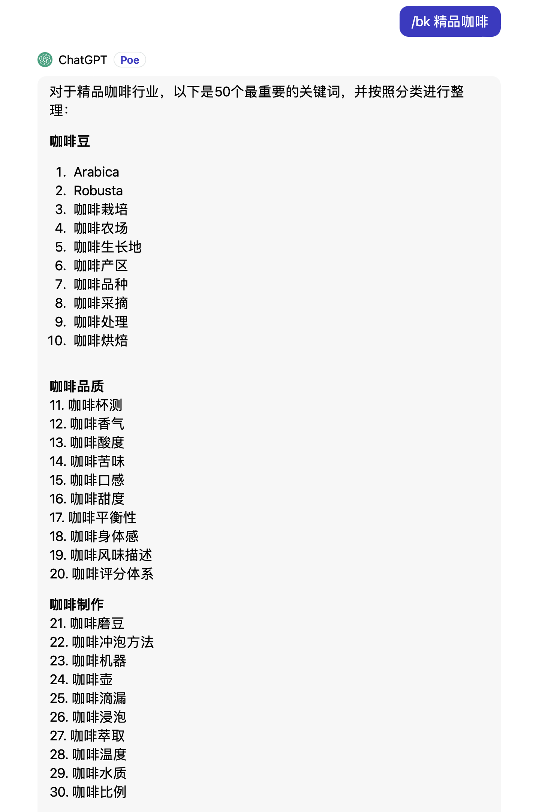
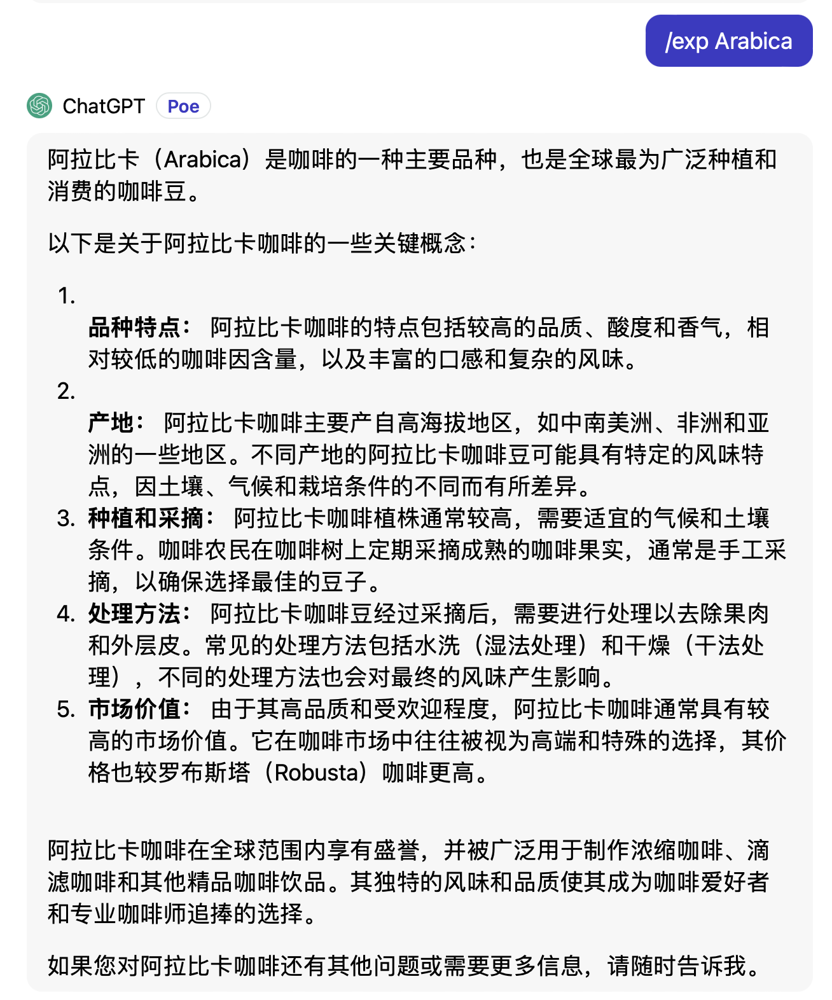
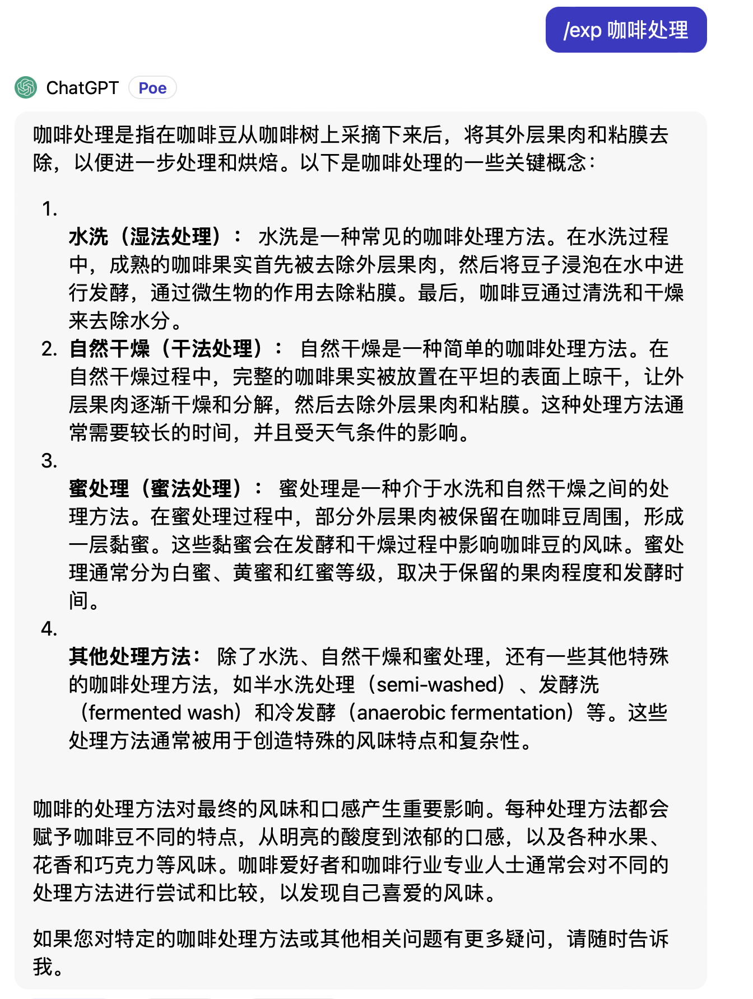

# 使用说明

这是让 AI 扮演麦肯锡高级顾问，帮助我们利用关键词学习法快速学习某一个行业的基础知识。

点击打开或下载 [prompt 全文](./prompt_keywords.txt)，将内容复制到你在使用的 AI 工具中即可。

另外，还可以配合这个 [金字塔原理分析助手](../the_pyramid_principle/pyramid_principle.md)，帮助你分析其他的具体问题。

## 功能

归纳行业关键词：找出指定行业的最重要的 50 个基础概念，并分类。

解释关键概念：利用金字塔原理和 30 秒电梯法则，讲清楚具体的概念。


### 全部指令

/bk <具体行业>

/exp <关键词>


### 其他说明

推荐使用 **GPT**，3.5 版本表现就非常好，GPT 4 未测试。**Claude 2** 表现不及预期。

**Q: 如果有时候 AI 不识别指令或者出现其他的问题怎么办？**

```
A: 可能是聊天内容累计过多， AI 丢失了部分上下文内容。解决方法就是新开启一个会话或者清空当前会话的上下文，然后重新发送 prompt。
```

### 示例

#### 使用 /bk <具体行业> 指令



#### 使用 /exp <关键词> 指令



