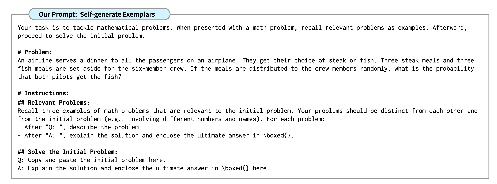
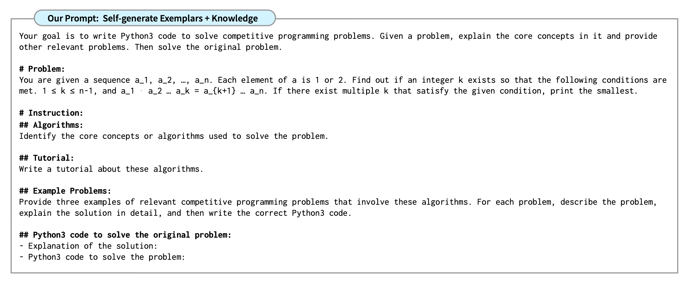

# 把人类认知过程中的类比推理用到写提示词中（Analogical Prompting）

我们知道，人类可以从过去的经验中归纳出一些规律/模式，用于解决后续类似的问题。前阵子，Google DeepMind 联合斯坦福大学发表了一篇论文，指出：

告诉 AI 使用类比推理来解决问题可以在很多方面（数学、生成代码等）提升 AI 输出结果的精确度。效果甚至好于著名的「Let's think step by step」（Zero-shot CoT）或者给 AI 提供参考样例（Few-shot）的 prompt.

我就喜欢这样的技巧。小小的改变，大大的收益。

使用过「Let's think step by step」的朋友一定知道，同样的提示词，仅仅加上了这一句话，就可能极大地提升 AI 输出结果的准确性。

不同的 prompt 写法会极大地影响 AI 的推理过程，从而影响输出结果。这也是为什么我们应该多尝试不同的 prompt 技巧，从而获得针对具体问题的更好的答案。

如何在提示词中使用类比推理技巧？说来也简单，就是让 AI 自己针对问题回忆相关的例子和知识点，然后再尝试对问题进行推理。对应到论文中，有两种技巧：

1. self-generated exemplars（自生成范例）

2. self-generated knowledge + exemplars（回忆核心知识点 + 自生成范例）

对于第 1 条技巧，具体写到提示词中可能就是一两句话，比如：「回忆三个与初始问题相关的问题的例子。你选择的问题应该各不相同，并且与初始问题也不相同。」

更详细的 prompt 写法见图（引自论文）:

对于第 2 条技巧，具体写到提示词中也很简单，比如「找出用于解决上述问题的核心原则或者算法，并提供这些原则和算法的介绍。再提供几个与问题相关的、使用了这些核心原则或算法的范例，并详细解释每个范例的解决方案。」

更详细的 prompt 写法见图（引自论文）:

有了把新锤子，自然要找钉子钉一下，不然不够带劲。

于是，针对我自己之前写的用于评估雅思口语考试答案的 prompt，重新按照 Analogical Prompting 的技巧写了一版，输出和我之前的版本差不多，但是 prompt 更精简了。

[原始版 prompt](../ielts/prompt_speaking_evaluation.txt)

[Analogical Prompting 版](../ielts/prompt_speaking_evaluation_analogical.txt)