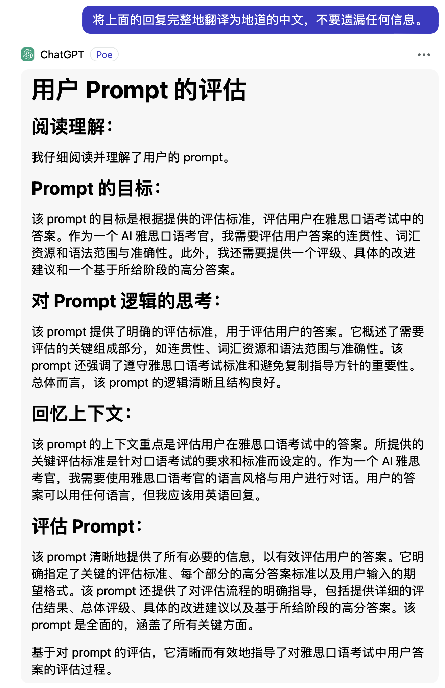

# 使用说明

这是让 AI 评估一个 prompt 是否足够有效的助手。

让 AI 从目标、逻辑、上下文这三个方面理解和分析指定的 prompt，并给出优化建议。

点击打开或下载 [prompt 全文](./prompt_eval.txt)，将内容复制到你在使用的 AI 工具中即可。

## 功能

将上面的 prompt 中的 **your prompt goes here** 替换成你自己的 prompt，然后发送给你当前用的 AI 即可。

### 其他说明

默认评估结果输出为英文，我自己测试下来，英文输出的评估结果比中文更加详细。如果你不想读英文，可以在评估结果出来之后，发送以下消息让 AI 将回复翻译为中文：
```
将上面的回复完整地翻译为地道的中文，不要遗漏任何信息。
```

更近一步，在评估结果出来之后，可以发送如下消息来让获取优化建议：
```
基于以上评估和用户的<prompt>，请修改出一个你认为更高效、更精简的版本。确保你的修改不遗漏原<prompt>的任务目标。
```

**Q: 如果有时候 AI 不识别指令或者出现其他的问题怎么办？**

```
A: 可能是下文内容聊天内容累计过多， AI 丢失了部分。解决方法就是新开启一个会话或者清空当前会话的上下文，然后重新发送 prompt。
```

### 示例

这是我评估 [雅思口语考试答案评估助理](../ielts/speaking_evaluation.md) 的结果。

