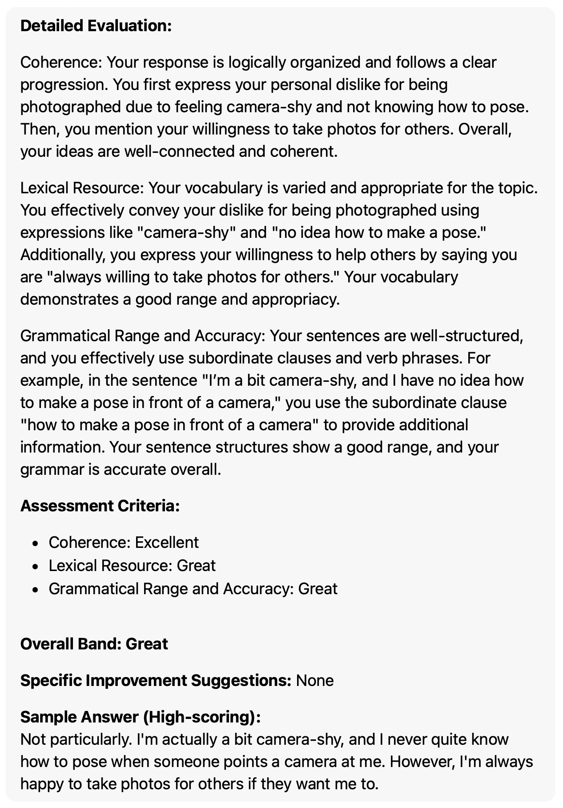
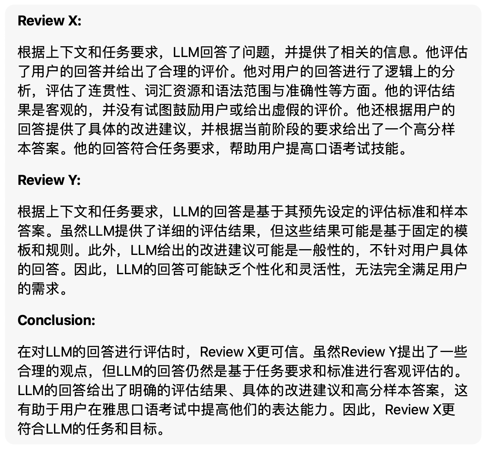

# 使用说明

这是让 AI 自己评估输出是否客观正确的助手。

让 AI 回忆上下文，思考目标和相关的理论/原则/标准，然后从相反的角度分别进行分析和评审。就像老顽童周伯通的左右互搏之术。

点击打开或下载 [prompt 全文](./prompt_result_eval.txt)，在其他 prompt 输出结果之后，发送该 prompt.

## 功能

默认是针对整个回复结果做评审，也可以稍微修改 prompt，让其针对回复中的某一项进行评审。

### 其他说明

**Q: 如果有时候 AI 不识别指令或者出现其他的问题怎么办？**

```
A: 可能是下文内容聊天内容累计过多， AI 丢失了部分。解决方法就是新开启一个会话或者清空当前会话的上下文，然后重新发送 prompt。
```

### 示例

这是我评估 [雅思口语考试答案评估助理](../ielts/speaking_evaluation.md) 的输出。

