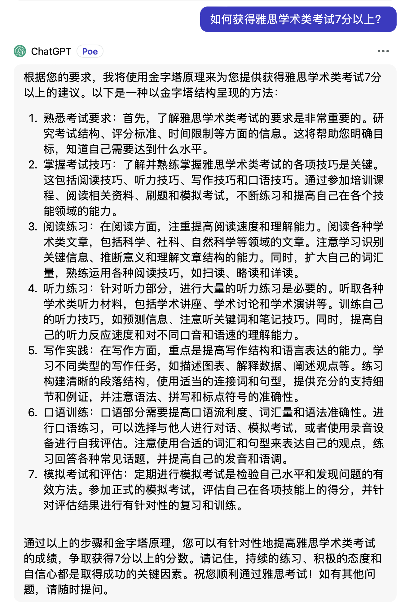
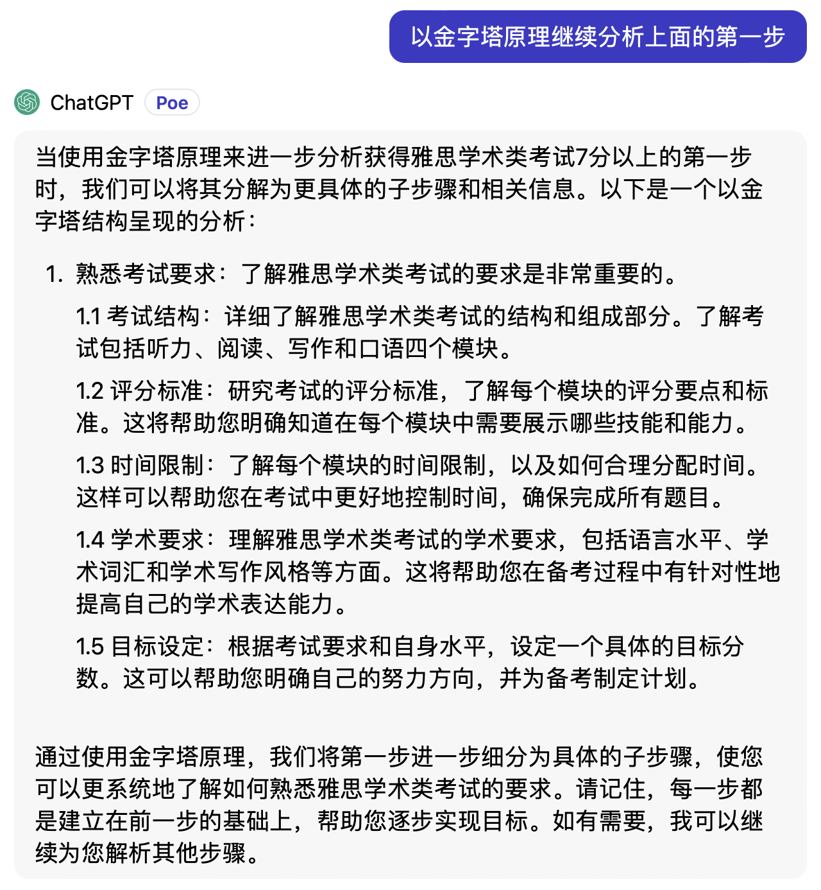
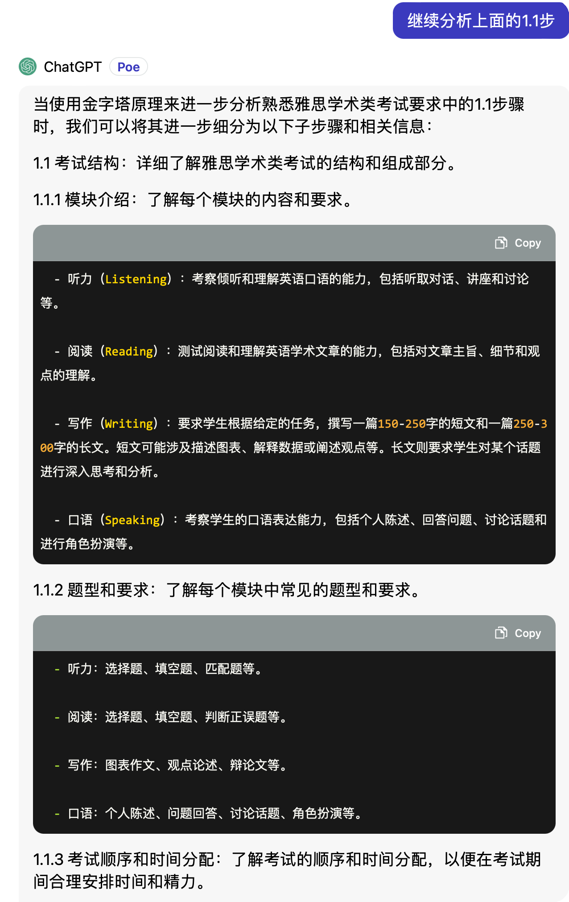

# 使用说明

这是让 AI 扮演麦肯锡的金字塔原理专家的 prompt.

金字塔原理：任何事情都可以归纳出一个中心点；而此中心论点又可以由横向的三到九个论据支撑；这三到九个论据本身可以是一个个论点，再被二级论据支撑，如此即可搭建出一个金字塔结构。

简单说，金字塔原理是一种分析具体问题的逻辑思考框架。借助 AI，我们可以快速获得关于某个具体问题的信息框架，特别是当我们对某个问题一无所知的时候。如果我们已经对某个问题有较深的了解，同样可以借助金字塔原理来检视我们的知识框架。

尽管，AI 给出的按照金字塔原理分析的结果不一定完全准确，但提供了很好的参考。

点击打开或下载 [prompt 全文](./prompt_pyramid_principle.txt)，将内容复制到你在使用的 AI 工具中即可。

该 prompt 的编写参考了 [Prompt Function](https://www.promptingguide.ai/applications/pf) 的方式，即以定义函数的方式进行 prompt 编写。这种方式特别适合把一个复杂的任务拆分为多个子任务，最后把子任务的结果汇总。如果一个 prompt 要同时提供几个相对独立的功能，这种 Prompt Function 的编写方式让 prompt 看起来更清晰，方便修改和微调。

## 功能

将上面的 prompt 发送给 AI 之后，它会给出一个几个要点，也可以说是金字塔的第一层，然后我们可以接着让它继续对一个个要点分别进行展开，最后获得一个完整的金字塔结构。

### 其他说明

在 **Claude 2** 和 **GPT 3.5** 测试过，效果均达到预期，**GPT 3.5** 似乎表现更加优秀。

**Q: 如果有时候 AI 不识别指令或者出现其他的问题怎么办？**

```
A: 可能是下文内容聊天内容累计过多， AI 丢失了部分上。解决方法就是新开启一个会话或者清空当前会话的上下文，然后重新发送 prompt。
```

### 示例

#### 从一个具体问题开始

 

#### 继续展开

 

#### 继续展开子节点

 